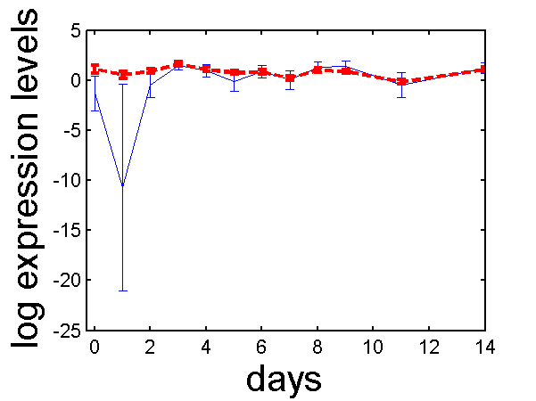

Microarray Probe Level Noise in PCA
===

The NPPCA software is available from here.

Current release is 0.111.

The software also relies on Ian Nabney's Netlab toolbox. It is available
from [here](http://www.aston.ac.uk/eas/research/groups/ncrg/resources/netlab/) and it needs the
digamma function, a version is available from Tom Minka's 'lightspeed'
toolbox
[here](http://research.microsoft.com/en-us/um/people/minka/software/lightspeed/).

You should also download the latest version of the NDLUTIL toolbox
utility files [from
here](/ndlutil/downloadFiles/). Make sure
that the NDLUTIL has priority over the lightspeed toolboxes as they both
contain different versions of the logdet function.

Demos in the Toolbox
--------------------

The toolbox can be used to recreate the experiments in the
bioinformatics paper. However running on full data sets takes overnight
on a desktop computer. We therefore suggest that you test the
implementation using the script.

```matlab 
>> demoOC1gata3
```

This will plot simple results from a reduced version of the OC1 data
set.



gata3 profile before (blue solid line) and after (red dash line)
analysis with PCA. Error bars are indicated which show for the blue line
the variance in the measurements and for the red the posterior profile
estimate variance.

Page last modified on Fri Jan 5 12:50:49 GMT 2007.
